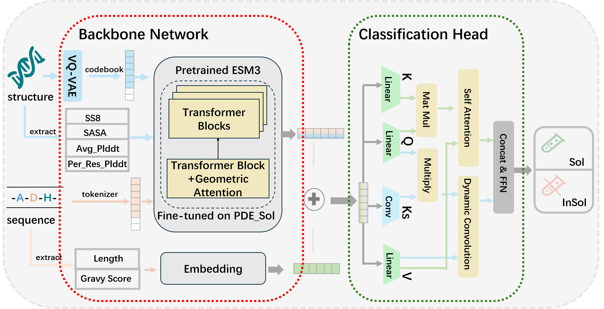
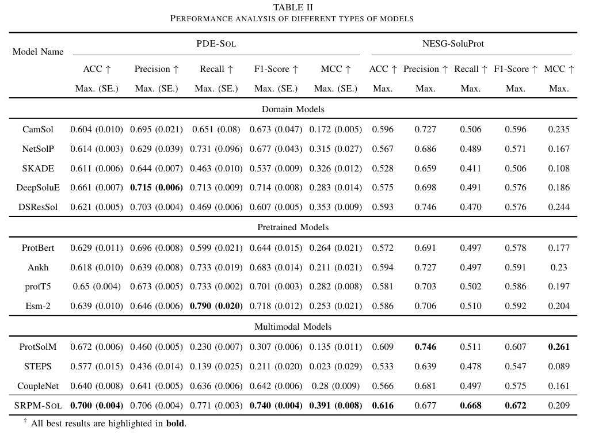

# SPRM-Sol: A Structure Robust Protein Multimodal Model for Solubility Prediction

# 🚀Introduction

The solubility of natural proteins is closely linked to their expression and purification processes. Accurate computational prediction of protein solubility not only aids in functional assessment but also reduces the cost of preliminary wet-lab experiments. The current mainstream deep learning prediction methods have begun to explore the multimodal framework. However, existing multimodal models mainly focus on sequences and structures, overlooking other influential factors. Additionally, inherent errors in predicted structure information pose a significant challenge to model robustness. To solve the above issues, we introduce SPRM-Sol, a novel multimodal protein solubility prediction model.



# 📈Results

## Paper results



# ⚙️Requirements

## Conda Enviroment

Please make sure you have installed Anaconda3 or Miniconda3.

Then

```cd SPRM-Sol```

You can create the required environment using the following method.

```
conda env create -f environment.yaml
conda activate sprm-sol
```

# 👉Start with SPRM-Sol

The JSON format of our data can be found in PDE Sol. We have open-sourced the [model weights](https://huggingface.co/winnw/SPRM-Sol) of SPRM-Sol for solubility prediction on Hugging Face. The weight files of various PLMs can be downloaded from the Transformers library. The protein structure [datasets](https://huggingface.co/datasets/winnw/PDE-Sol/tree/main) used for SPRM-Sol training are also uploaded to Hugging Face.

## Start Testing 
You need to download our dataset and wight. Then put them into PDE-Sol/pdb and weight/ respectively.

```
python src/eval.py 
--test_file_path PDE-Sol/json
--pdb_folder PDE_Sol/pdb 
--pdb_index PDE_Sol/pdb_index.json 
----pretrained_path ckpt/SRPM-Sol.pth 
```

## Your own dataset

### what you need

* json files including name,sequence,plddt,solubility(e.g. PDE-Sol/json)
* pdb files directory
* a pdb_index.json (e.g. PDE-Sol/pdb_index.json)

```
python train.py\
--file_path $PDE-Sol/<your dataset>$
--pdb_folder $PDE-Sol/<your dataset>$
--pdb_index $PDE-Sol/pdb_index.json$
--sequence_max_length 256
--epoch 50
--model_dir ckpt
```

